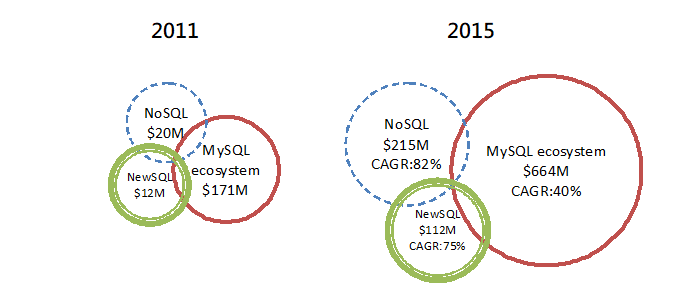

# Introduction

在資料庫系統技術發展已超過30年之後，“The Traditional RDBMS Wisdom is All Wrong”\[1\]，Postgres的創辦人及MIT教授的Michael Stonebreaker卻做了這樣的表示。

Big data是近年來資料庫技術開始改變的契機，因為資料型態與應用的改變，傳統資料庫技術開始遭遇挑戰，穩固的基石也隨之動搖，也迫使各界開始重新定義與發展新的資料庫系統技術。相較於許多新興的資訊技術，資料庫技術因為發展已久，資料的使用型態長期穩定，缺少了創新的動能，而非技術無突破空間。以代表性而論，從SQL類的關連式資料庫，到革新的NoSQL類資料庫，至新興的NewSQL類資料庫，它們代表的並非只是另一套資訊系統分類，而是引領資料庫系統思維的創新。

圖1. MySQL, NoSQL, NewSQL revenue\[2\]

由圖1之市場分析可知，NewSQL並非是一統江湖的概念，事實上，無論SQL類資料庫或NoSQL類資料庫，都有其適用的市場，彼此之間關係為互補，而非競爭。這與過去僅有SQL類資料庫的市場組成已完全不同。而NewSQL的定義，由於百家爭鳴，本文所採用的是較為簡潔的概念，由451group\[3\]所提出的：SQL-like語法介面、NoSQL所提倡的延展性、應用專屬資料設計。

簡而言之，NewSQL類資料庫系統企圖在SQL與NoSQL之間取得某種平衡點，而其取捨即歸於特定應用專屬之資料處理需求。資料庫系統處理的是人與資料的關聯，而資料庫產品市場也已走向多元性發展，傳統上所謂「最好的資料庫系統」已不存在，而是以使用者為導向，建立資料思維，方能決定最適合的資料庫系統。

